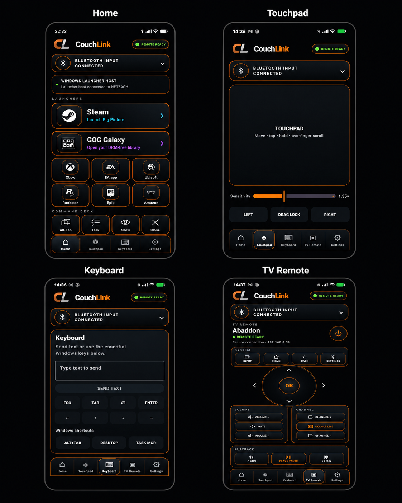

<div align="center">


# CouchLink

### A premium Android couch remote for Windows gaming and Google TV control.


**Bluetooth input at Windows sign-in. Rich launcher control after sign-in. Secure Google TV control from the same app.**

**No account, cloud relay, analytics, advertising, or required internet service.**

</div>

---

## CouchLink at a glance

<p align="center">
  
</p>

CouchLink brings the main living-room controls into one consistent Android interface:

- **Home** — launch and manage PC game launchers from the couch.
- **Touchpad** — move, tap, hold, drag, and scroll with adjustable sensitivity.
- **Keyboard** — send text and use essential Windows keys and shortcuts.
- **TV Remote** — securely control a paired Google TV, including navigation, playback, power, volume, channels, settings, Google Live, and verified Hisense input switching.

---

## How CouchLink works

CouchLink uses independent connection paths so each feature remains useful even when another component is unavailable.

| Path | Responsibility | Available at Windows sign-in? |
|---|---|---|
| **Android Bluetooth HID** | Keyboard, mouse, touchpad, media keys, shortcuts, and sign-in input | **Yes** |
| **Windows Launcher Host** | Local discovery, trusted pairing, launcher actions, and live state feedback | After desktop login |
| **Google TV Remote v2** | Secure TV pairing, navigation, playback, power, volume, channels, settings, and app-link actions | Independent of the Windows host |
| **Wake-on-LAN** | Powers on a configured TV that supports network wake | While the TV is in supported standby |

The Android remote remains useful when the optional Windows host is closed or unavailable. Launcher tiles prefer the host when connected and fall back to Bluetooth commands when appropriate. TV control uses its own secure local connection.

## Highlights

### Windows couch control

- Real Bluetooth keyboard and mouse behavior without a Windows input driver.
- Full-screen touchpad with adjustable sensitivity, two-finger scrolling, and drag lock.
- Text entry, navigation keys, and essential Windows shortcuts.
- Eight first-class launcher integrations:
  - Steam
  - GOG Galaxy
  - Xbox
  - EA app
  - Ubisoft Connect
  - Rockstar Games Launcher
  - Epic Games Launcher
  - Amazon Games
- Local-only Windows host with six-digit pairing and persistent trusted-device tokens.
- Automatic trusted reconnect, heartbeat monitoring, launcher-state feedback, and Bluetooth fallback.

### Google TV remote

- Secure Google TV Remote v2 certificate pairing.
- D-pad, OK, Home, Back, and Settings controls.
- Volume, mute, channel, playback, and one-minute skip controls.
- Google TV **Live** tab navigation without opening the antenna tuner.
- Power-off through the secure remote connection.
- Wake-on-LAN power-on with automatic reconnect.
- Premium source selector with verified Hisense hardware mappings for HDMI 1–3, composite, and TV/antenna.
- Clear Ready, Connecting, Standby, Reconnecting, and Pairing Required states.
- Premium haptic feedback with accidental Power double-tap protection.

> **Current hardware validation:** the complete TV Remote feature set has been verified on a Hisense A6H Google TV. Standard Google TV controls should be broadly reusable, while direct input mappings are TV-model and firmware dependent.

### Privacy and resilience

- Local network communication only.
- No CouchLink account or cloud service.
- No telemetry, analytics, advertising, or behavioral tracking.
- Independent failure boundaries: a Windows host outage does not disable Bluetooth input, and TV control does not depend on the Windows host.

## Repository layout

```text
CouchLink/
├── Build-Release.ps1         Complete stable-release builder
├── tools/                    Source-manifest update and verification
├── src/
│   ├── android/              Android Bluetooth HID, launcher, and TV remote client
│   └── windows/              Optional Windows launcher host
├── docs/
│   ├── architecture/         Current system design and protocol boundaries
│   ├── building/             Build and test instructions
│   ├── images/               README and release artwork
│   ├── release/              Installation, signing, notes, and release checklists
│   ├── tv-remote/            TV Remote roadmap and validation checklists
│   └── history/              Preserved development notes and old manifests
├── CHANGELOG.md
├── CONTRIBUTING.md
├── LICENSE
├── NOTICE
├── PRIVACY.md
├── SECURITY.md
└── TRADEMARKS.md
```

## Build

### Android debug build

```powershell
cd .\src\android
.\gradlew.bat clean :app:assembleDebug
```

Install the resulting APK:

```powershell
adb install -r .\app\build\outputs\apk\debug\app-debug.apk
```

The installed application label is simply **CouchLink** in both debug and release builds.

### Windows host

```powershell
cd .\src\windows
dotnet build .\CouchLink.sln -c Release
dotnet run --project .\CouchLink.Host.Wpf\CouchLink.Host.Wpf.csproj
```

### Complete signed release

From PowerShell on Windows:

```powershell
.\Build-Release.ps1
```

The release builder prompts for the private Android signing key, builds the signed APK and Windows EXE, verifies the expected signing certificate, packages a clean source archive and release documents, and generates SHA-256 checksums for every distributable artifact.

See [BUILDING.md](docs/building/BUILDING.md) for complete build and publish commands.

## Current release line

| Component | Version | Status |
|---|---:|---|
| Android remote | `1.2` (`versionCode 120`) | Stable |
| Windows Launcher Host | `1.1` | Stable |
| Shared launcher protocol | `1` | UDP discovery + framed TCP session |
| Google TV protocol | Remote v2 | Secure local TLS pairing and control |

CouchLink 1.1 was promoted to stable on **July 24, 2026**. CouchLink 1.2 adds the complete Google TV Remote experience and its premium visual integration.

## Documentation

- [Installation and pairing](docs/release/INSTALLATION.md)
- [Architecture](docs/architecture/ARCHITECTURE.md)
- [Build instructions](docs/building/BUILDING.md)
- [Integration testing](docs/building/TESTING.md)
- [Android signing](docs/release/ANDROID-SIGNING.md)
- [TV Remote roadmap](docs/tv-remote/ROADMAP.md)
- [Release notes for 1.2](docs/release/RELEASE-NOTES-v1.2.md)
- [Release checklist for 1.2](docs/release/RELEASE-CHECKLIST-v1.2.md)
- [Release validation for 1.2](docs/release/RELEASE-VALIDATION-v1.2.md)
- [Release notes for 1.1](docs/release/RELEASE-NOTES-v1.1.md)
- [Release validation for 1.1](docs/release/RELEASE-VALIDATION-v1.1.md)
- [Changelog](CHANGELOG.md)
- [Privacy](PRIVACY.md)
- [Security policy](SECURITY.md)
- [Contributing](CONTRIBUTING.md)
- [Trademark and brand policy](TRADEMARKS.md)

## License and branding

CouchLink source code is licensed under the [Apache License 2.0](LICENSE).

The **CouchLink** name, **CL** branding, icons, logos, original artwork, screenshots, and official visual identity are governed separately by the [CouchLink Trademark and Brand Policy](TRADEMARKS.md). Forks may use the Apache-licensed code, but must rename and rebrand unless explicitly authorized.
