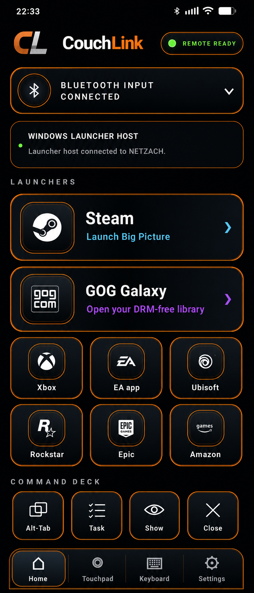

<div align="center">


# CouchLink

### A polished Android remote and local Windows launcher host for couch gaming.


**Bluetooth input at sign-in. Rich launcher control after sign-in. No account, cloud relay, analytics, or advertising.**

</div>

---

## Screenshot
<p align="center">
  
</p>

---

## What CouchLink does

CouchLink combines two independent connection paths so each can handle the job it does best:

| Path | Responsibility | Available at Windows sign-in? |
|---|---|---|
| **Android Bluetooth HID** | Keyboard, mouse, touchpad, media keys, shortcuts, and sign-in input | **Yes** |
| **Windows Launcher Host** | Local discovery, trusted pairing, launch/focus/close actions, and live launcher-state feedback | After desktop login |

The Android remote remains useful when the optional Windows host is closed or unavailable. Launcher tiles prefer the host when connected and fall back to Bluetooth commands when needed.

## Highlights

- Real Bluetooth keyboard and mouse behavior without a Windows input driver.
- Premium couch-friendly Android interface with touchpad, keyboard, command deck, and launcher tiles.
- Eight first-class launcher integrations: Steam, GOG Galaxy, Xbox, EA app, Ubisoft Connect, Rockstar Games Launcher, Epic Games Launcher, and Amazon Games.
- Local-only Windows host with six-digit pairing and persistent trusted-device tokens.
- Automatic trusted reconnect, heartbeat monitoring, launcher-state feedback, and Bluetooth fallback.
- Independent failure boundaries: a host outage does not disable Bluetooth input.
- No account, cloud service, telemetry, analytics, or advertising.

## Repository layout

```text
CouchLink/
├── Build-Release.ps1         Complete stable-release builder
├── tools/                     Source-manifest update and verification
├── src/
│   ├── android/              Android Bluetooth HID remote and launcher client
│   └── windows/              Optional Windows launcher host
├── docs/
│   ├── architecture/         Current system design and protocol boundaries
│   ├── building/             Build and test instructions
│   ├── release/              Installation, signing, notes, and release checklist
│   └── history/              Preserved development notes and old manifests
├── CHANGELOG.md
├── CONTRIBUTING.md
├── LICENSE
├── NOTICE
├── PRIVACY.md
├── SECURITY.md
└── TRADEMARKS.md
```

## Build

### Complete signed release

From PowerShell on Windows:

```powershell
.\Build-Release.ps1
```

This prompts for the private Android signing key, builds the signed APK and Windows EXE, verifies the expected signing certificate, packages a clean source archive and release documents, and generates SHA-256 checksums for every distributable artifact.

### Android

```powershell
cd .\src\android
.\gradlew.bat clean :app:assembleDebug
```

Or open `src/android` directly in Android Studio.

### Windows host

```powershell
cd .\src\windows
dotnet build .\CouchLink.sln -c Release
dotnet run --project .\CouchLink.Host.Wpf\CouchLink.Host.Wpf.csproj
```

See [BUILDING.md](docs/building/BUILDING.md) for complete build and publish commands.

## Release baseline

CouchLink 1.1 was promoted to stable on **July 24, 2026**.


| Component | Version | Status |
|---|---:|---|
| Android remote | `1.1` (`versionCode 106`) | Stable |
| Windows Launcher Host | `1.1` | Stable |
| Shared protocol | `1` | UDP discovery + framed TCP session |

## Documentation

- [Installation and pairing](docs/release/INSTALLATION.md)
- [Release notes for 1.1](docs/release/RELEASE-NOTES-v1.1.md)
- [Release validation](docs/release/RELEASE-VALIDATION-v1.1.md)
- [Release checklist](docs/release/RELEASE-CHECKLIST-v1.1.md)
- [Publishing guide](docs/release/PUBLISHING-v1.1.md)
- [Architecture](docs/architecture/ARCHITECTURE.md)
- [Build instructions](docs/building/BUILDING.md)
- [Integration testing](docs/building/TESTING.md)
- [Android signing](docs/release/ANDROID-SIGNING.md)
- [Changelog](CHANGELOG.md)
- [Privacy](PRIVACY.md)
- [Security policy](SECURITY.md)
- [Contributing](CONTRIBUTING.md)
- [Trademark and brand policy](TRADEMARKS.md)

## License and branding

CouchLink source code is licensed under the [Apache License 2.0](LICENSE).

The **CouchLink** name, **CL** branding, icons, logos, original artwork, screenshots, and official visual identity are governed separately by the [CouchLink Trademark and Brand Policy](TRADEMARKS.md). Forks may use the Apache-licensed code, but must rename and rebrand unless explicitly authorized.
