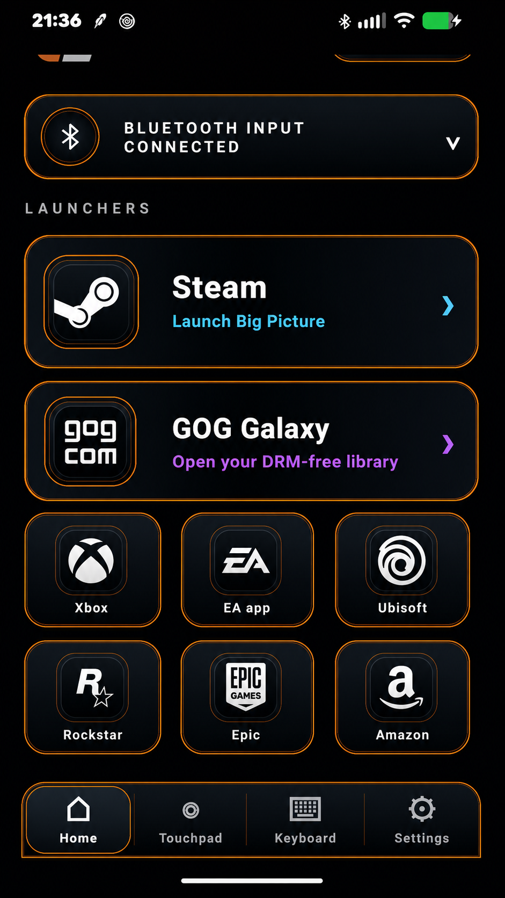

<div align="center">


# CouchLink

### Turn your Android phone into a premium Bluetooth remote for Windows.

<p>
  
  
  
  
  
</p>

**Keyboard. Mouse. Touchpad. Launcher deck. No Windows companion app required.**

</div>

---

## What is CouchLink?

CouchLink turns a compatible Android phone into a persistent Bluetooth HID keyboard and mouse for Windows. It is built for living-room PCs, gaming setups, media systems, and those moments when the keyboard is across the room.

Because CouchLink uses the standard Windows Bluetooth HID stack, it can provide input at the Windows sign-in screen without a custom driver, cloud account, disabled Secure Boot, or Windows Test Mode.

<div align="center">
  
</div>

## Highlights

| Feature | What it provides |
|---|---|
| **Bluetooth HID** | Persistent keyboard and mouse input directly over Bluetooth |
| **Windows sign-in support** | Control the PC before the desktop and companion software are available |
| **Touchpad controls** | Pointer movement, left/right click, scrolling, and drag lock |
| **Keyboard deck** | Text entry, media keys, navigation, and Windows shortcuts |
| **Launcher deck** | One-tap access to major PC game launchers |
| **Automatic reconnect** | Hardened foreground-service behavior for dependable living-room use |
| **Private by design** | No account, advertisements, analytics, telemetry, or cloud relay |

## Supported launchers

<table>
<tr>
<td align="center"><b>Steam</b><br><sub>Big Picture</sub></td>
<td align="center"><b>GOG Galaxy</b><br><sub>DRM-free library</sub></td>
<td align="center"><b>Xbox</b><br><sub>Xbox app</sub></td>
<td align="center"><b>EA app</b><br><sub>Electronic Arts</sub></td>
</tr>
<tr>
<td align="center"><b>Ubisoft Connect</b></td>
<td align="center"><b>Rockstar Games</b></td>
<td align="center"><b>Epic Games</b></td>
<td align="center"><b>Amazon Games</b></td>
</tr>
</table>

## Requirements

- Android 9 or newer
- Android device with Bluetooth HID device support
- Windows computer with Bluetooth
- JDK 17 and Android SDK 36 for source builds

## Build from source

### Debug build

```powershell
.\gradlew.bat clean :app:assembleDebug
```

The debug variant uses the package suffix `.debug`, allowing it to coexist with the signed stable release.

### Signed stable build

Create the permanent release keystore once:

```powershell
.\tools\New-CouchLinkKeystore.ps1
```

Build and verify the signed release:

```powershell
.\tools\Build-SignedRelease.ps1 `
  -KeystorePath "C:\full\path\to\couchlink-release.jks"

.\tools\Verify-SignedRelease.ps1
```

The release workflow writes the finished files to:

```text
release\CouchLink-v1.0.apk
release\CouchLink-v1.0.apk.sha256
```

> [!IMPORTANT]
> Back up the release keystore and both passwords securely. Every future Android update must be signed with the same key.

See [SIGNING.md](SIGNING.md) for the complete signing procedure.

## Release information

| Property | Value |
|---|---|
| Version | `1.0` |
| Version code | `100` |
| Stable application ID | `dev.typezero.couchlink.remote` |
| Debug application ID | `dev.typezero.couchlink.remote.debug` |
| Minimum Android | API 28 / Android 9 |
| Target and compile SDK | API 36 |
| Java toolchain | JDK 17 |

Before publishing or tagging the stable release, complete the [v1.0 release checklist](RELEASE-CHECKLIST-v1.0.md).

## Privacy

CouchLink communicates directly with the paired computer over Bluetooth. It does not require an account and does not include advertising, analytics, telemetry, or cloud data transmission.

Read the full [privacy statement](PRIVACY.md).

## Documentation

- [Release notes](RELEASE-NOTES-v1.0.md)
- [Signing guide](SIGNING.md)
- [Release checklist](RELEASE-CHECKLIST-v1.0.md)
- [Privacy statement](PRIVACY.md)
- [Source manifest](SOURCE-MANIFEST-v1.0.sha256)

## License

CouchLink is licensed under the **Apache License 2.0**. See the [LICENSE](LICENSE) file for the full terms.

---

<div align="center">

**CouchLink 1.0**  
Built for the couch. Connected directly to Windows.

</div>
